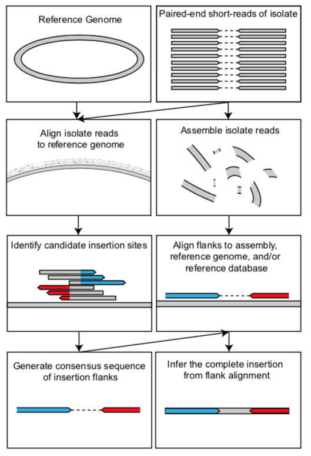

[Back to main page](../README.md)  

# How it works
The *mustache* workflow is described by the schematic below:

All that is required is a reference genome and short-read (less than 300 bp) sequencing data of the orgnaism under study.

The *mustache* software suite provides tools to perform most of the analyses above, including:

* Identifying candidate insertion sites and generates consensus sequence of insertion flanks (see `findflanks` and command)
* Pairs candidate insertion flanks with each other (see `pairflanks` command)
* Infers sequence identity from a sequency assembly (see `inferseq-assembly` command)
* Infers sequence identity from a reference genome (see `inferseq-reference` command)
* Infers sequence identity from a database of known inserted elements (see `inferseq-database` command)
* Infers sequence identity by attempting to merge flanks in the event that they are long enough to overlap and span the etire insertion (see `inferseq-overlap` command)
* EXPERIMENTAL: Extends candidate insertion flanks using a local alignment approach.

It does NOT perform the following steps:
* Alignment of isolate to sample (We recommend [BWA MEM](http://bio-bwa.sourceforge.net/) for this step.)
* Assembly of short-read sequencing reads (We recommend [SPAdes](http://cab.spbu.ru/software/spades/) for this step.)

## Limitations
Identifying large structural variants from short-read sequencing data is always a quesiton of inference. 
The insertions identified in this pipeline are no different, but we try to increase our sensitivity by combining several 
different inference approaches. However, there are limitations that should be taken into account with this analysis, such as:

1. We only identify those insertions that occur within the reference genome used.
2. We usually cannot know the full identity of the inserted sequence if it greatly exceeds the libraries read length and fragment size. 
We can only know the identity of its flanks.

[NEXT: Install or update software](docs/install.md)